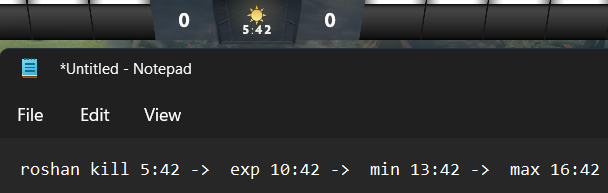

=========================
DotA 2 Roshan Death Timer
=========================

DotA 2 Roshan death timer macros, using computer vision. Tracks expiration time, minimum and
maximum respawn timer as contents of your clipboard. Handy in combination with `Win+V <https://support.microsoft.com/en-us/windows/clipboard-in-windows-c436501e-985d-1c8d-97ea-fe46ddf338c6>`_ clipboard hotkey.
Should work on any 1920x1080 screen, other monitor sizes not tested.

You may or may not get VAC-banned for using this in your games, though I *presume* that a ban is unlikely as you are not interacting with DotA files in any direct or indirect way.
Use on your own risk.

By default (``dota_2_rosh_timer.pyw``), this tracks the Roshan timer. One can also specify command line arguments to track:

* Glyph cooldown: ``dota_2_rosh_timer.pyw glyph``
* Buyback cooldown: ``dota_2_rosh_timer.pyw buyback``
And, with the help `OpenDotA's DotA 2 constants API <https://github.com/odota/dotaconstants>`_, one can also track the following:

* Item cooldown: e.g. ``dota_2_rosh_timer.pyw item black_king_bar``
* Abilities cooldown: e.g. ``dota_2_rosh_timer.pyw ability faceless_void_chronosphere``

If needed, the script can also output time splits in Russian or Spanish (e.g. ``dota_2_rosh_timer.pyw glyph --language russian``).

In case you want to force update abilities or items cooldown cache, you also can use the ``--force_update`` flag.

Installation guide
--------

#. Install Python_, version 3.10 or above. Make sure not to untick the box to register Python directory in your PATH variable.
#. Download the latest release_.
#. Set up a macros to run *"rosh_death_timer.pyzw"* script using a hotkey of your choice. I recommend either using your specialized mouse and keyboard software or AutoHotKey_.
#. Additionally, `create a .bat file <https://datatofish.com/batch-python-script/>`_ and specify other macros to run the same script with ``glyph``, ``buyback``, ``item`` or ``ability`` arguments.
#. Additionally, specify whether you'd like to have an output for time splits in other languages (Russian, Spanish).
#. The first run will take significantly longer, as you will have to download required data for OCR.

Credits
-------

This package was created with Cookiecutter_ and the `audreyr/cookiecutter-pypackage`_ project template. All the heavy
lifting is done with EasyOCR_, OpenCV_ and OpenDotA_.

License
-------
MIT_

.. _AutoHotKey: https://www.autohotkey.com/docs/commands/Run.htm
.. _Python: https://www.python.org/downloads/
.. _EasyOCR: https://github.com/JaidedAI/EasyOCR
.. _OpenCV: https://opencv.org/
.. _OpenDota: https://www.opendota.com/
.. _Cookiecutter: https://github.com/audreyr/cookiecutter
.. _`audreyr/cookiecutter-pypackage`: https://github.com/audreyr/cookiecutter-pypackage
.. _MIT: https://github.com/vovavili/dota_rosh_timer/blob/master/LICENSE
.. _release: https://github.com/vovavili/dota_rosh_timer/releases
.. _Code: https://github.com/vovavili/dota_rosh_timer/archive/refs/heads/master.zip
